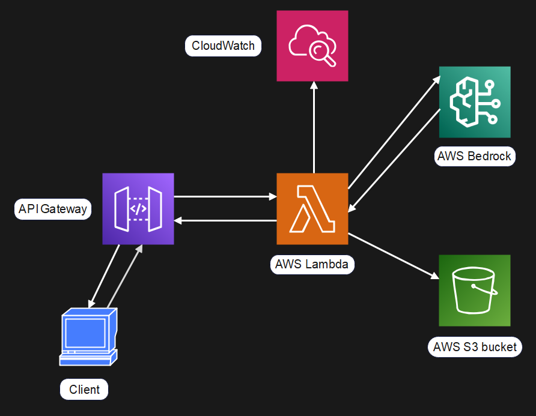

# Prompt2Post: Your AI Blog Generator Powered by AWS! 🧠✍️

Welcome to Prompt2Post, an innovative AI blog generator that transforms user inputs into high-quality blog content using AWS services. This project leverages a suite of AWS tools to provide a seamless and scalable solution for automatic content generation.

---

## Project Overview

Prompt2Post is designed to make blog creation effortless. By integrating cutting-edge AWS technologies, this tool can generate human-like blog posts based on user-provided topics. The system is built to be both scalable and cost-efficient, handling content generation dynamically as per user requests.

---

## Architecture

The architecture of Prompt2Post includes the following AWS components:

- **API Gateway**: The entry point that handles and routes user requests to the backend AWS Lambda functions.

- **AWS Lambda**: Executes serverless functions triggered by user requests. It processes these requests using AWS Bedrock to generate blog content.

- **AWS Bedrock**: Utilizes Llama 3 models to create high-quality, human-like text output for blog content generation.

- **Amazon S3**: Stores the generated blog content securely and allows for quick retrieval.

- **API Response**: Delivers the generated content back to the user in real-time after storage.



---

## Key Insights

- **Modular Architecture**: Combines API Gateway, Lambda, Bedrock, and S3 for a flexible, serverless solution. Each component is scalable and decoupled.
  
- **Serverless Efficiency**: Lambda provides event-driven processing, reducing the need for dedicated servers and making the system cost-effective.
  
- **AI-Powered Content Creation**: Leverages Llama 3 models in AWS Bedrock for high-quality, human-like text generation.
  
- **Cloud Storage Integration**: Amazon S3 ensures secure, scalable storage for generated content.

- **API Management**: Efficient handling and routing of requests via API Gateway.

- **Monitoring and Logging**: Insights into monitoring application performance and troubleshooting issues.

---

## Tech Stack

- **AWS API Gateway**: Manages incoming requests.
  
- **AWS Lambda**: Executes serverless code.
  
- **AWS Bedrock**: Generates blog content.
  
- **Amazon S3**: Stores content securely.

---

## Test It Out

To see Prompt2Post in action, you can test the API endpoint:

```
https://p9cefdi2aj.execute-api.us-east-1.amazonaws.com/dev/bloggeneration
```
- **Body**

``` javascript
{
    "blog_topic":"Your_topic_name"
}
```

